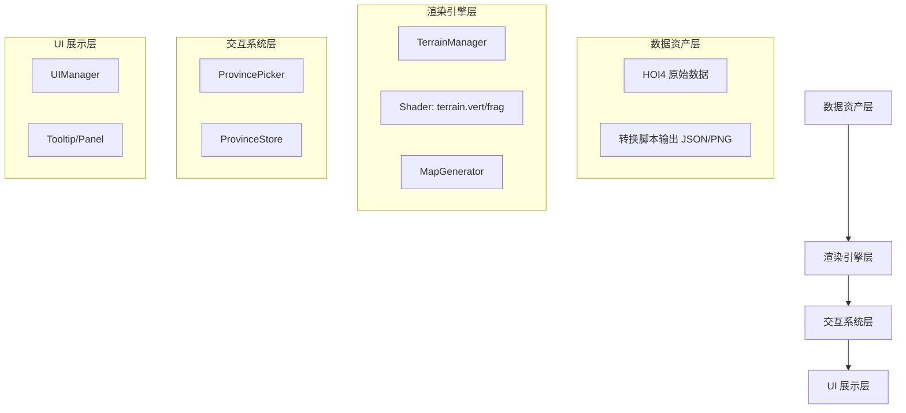
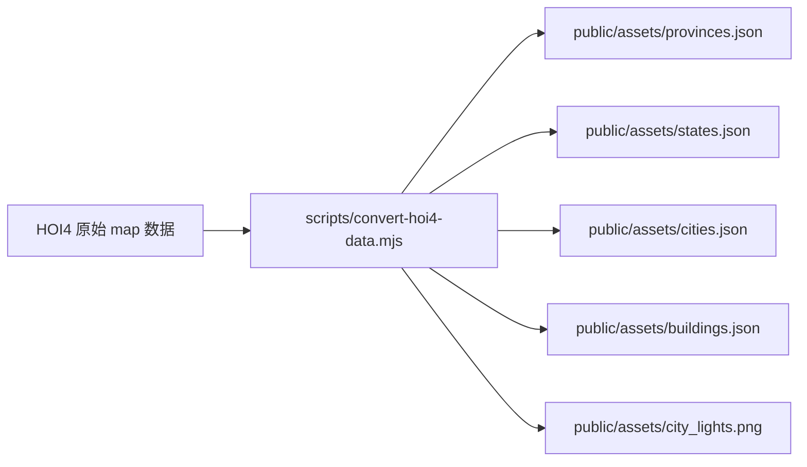
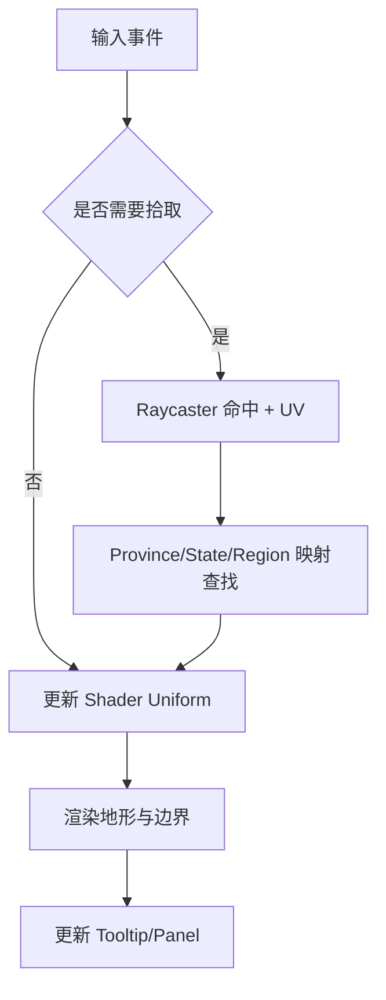

# HOI4 风格 3D 交互地图：总体架构与文档规范

## 0. 文档定位与交叉引用

### 0.1 文档定位
- **文档层级**：L1（总览/基线）
- **作用**：定义全局约束（术语、模式编号、渲染优先级、验收标准），作为专题文档的统一参照。
- **目标读者**：渲染开发、交互开发、数据转换脚本开发、测试与维护人员。

### 0.2 `plans/` 文档层级与职责矩阵

| 层级 | 文档 | 职责 | 不负责内容 |
|---|---|---|---|
| L1 总览 | `architecture_design.md` | 全局术语、统一约定、系统分层、跨专题基线 | 具体专题实现细节 |
| L2 专题 | `state_admin_divisions.md` | State / Strategic Region 交互与边界专题设计 | 城市灯光与建筑实例化细节 |
| L2 专题 | `city_and_lights_architecture.md` | 城市灯光 + 建筑实例化 + 贴地算法专题设计 | State 专题交互规则 |

### 0.3 交叉引用入口
- State 专题：[`state_admin_divisions.md`](./state_admin_divisions.md)
- 城市与灯光专题：[`city_and_lights_architecture.md`](./city_and_lights_architecture.md)

---

## 1. 目标与范围

### 1.1 目标
在浏览器中以 Three.js + TypeScript 实现 HOI4 风格 3D 交互地图，满足以下基线：
1. 地形起伏、地块拾取、模式切换可用。
2. Province / State / Strategic Region 分层渲染规则清晰。
3. 城市灯光与建筑系统可在性能可控前提下落地。
4. 文档结构一致，可维护、可回归、可扩展。

### 1.2 范围
- 离线数据转换：HOI4 原始资源 → `public/assets/*.json|*.png`。
- 运行时渲染：地形、边界线、高亮、模式切换。
- 运行时交互：悬停、选中、面板联动。
- 专题能力：State 行政区体系、城市灯光与建筑实例化。

### 1.3 非目标
- 不在本轮引入全新地图模式（保持 4 模式基线）。
- 不在本轮直接支持 Paradox `.mesh` 原生加载。
- 不在本轮引入复杂后处理（如体积云、全局光照）。

---

## 2. 术语与统一约定

### 2.1 核心术语（统一口径）

| 术语 | 定义 | 主数据源 |
|---|---|---|
| Province | 最小可交互地块单元 | `provinces.png` + `provinces.json` |
| State | 一级行政区（由多个 Province 组成） | `states.json` |
| Strategic Region | 战略区域（海域重点） | `states.json` / 战略区域数据 |
| LUT | 查找纹理（颜色映射辅助纹理） | 运行时生成或离线生成 |
| Grounding | 建筑贴地流程（避免浮空/半埋） | 城市专题算法 |

### 2.2 地图模式编号（统一）

| 编号 | 模式 | 说明 |
|---|---|---|
| 0 | 政治模式 | 国家色与边界层级可见 |
| 1 | 地形模式 | 地形底色主导，保留必要边界 |
| 2 | 高度模式 | 高度伪彩主导 |
| 3 | 行政区模式 | State 颜色主导 |

### 2.3 高亮与边界统一规则
1. **高亮视觉优先级**：`Province > State > Strategic Region`。
2. **陆地边界层级**：`国家 > State > Province`。
3. **海域边界层级**：`Strategic Region 主线 + 必要 Province 细线`。
4. **作用域约束**：
   - 陆地不显示 Strategic Region 高亮/主线。
   - 海域不显示 State 高亮/边界。

### 2.4 命名规范
- 运行时字段统一使用 `camelCase`（如 `provinceToState`、`hoveredStateColor`）。
- 文档标题统一使用“名词 + 目标”格式（如“验收与回归”）。
- 同一概念在全仓不混用中英文别名（优先使用 Province / State / Strategic Region）。

---

## 3. 数据输入输出与依赖

### 3.1 技术栈与核心依赖
| 类别 | 选型 |
|---|---|
| 构建工具 | Vite |
| 语言 | TypeScript |
| 渲染引擎 | Three.js (WebGL) |
| Shader | GLSL（`terrain.vert.glsl` / `terrain.frag.glsl`） |
| 数据转换 | Node.js 脚本（`scripts/convert-hoi4-data.mjs`） |

### 3.2 核心输入资产
- 高度图：`heightmap.png`
- 地块图：`provinces.png`
- 地形与水体纹理：`terrain_colormap.png`、`terrain_water.png`
- 行政区数据：`states.json`
- 城市与建筑数据：`cities.json`、`buildings.json`（专题输出）

### 3.3 核心输出资产
- 渲染纹理：`city_lights.png`、LUT 纹理（运行时或离线）
- 数据索引：`provinceToState`、`provinceToStrategicRegion`
- UI 输入数据：地块/行政区/海域详细信息结构

---

## 4. 架构与流程设计

### 4.1 系统分层

### 4.2 离线数据流（转换阶段）

### 4.3 运行时渲染流（每帧）

---

## 5. 实施计划

### 5.1 阶段划分
1. **Phase A：基础地形与交互基线**
   - 完成地形渲染、Province 拾取、基础 UI 联动。
2. **Phase B：State / Strategic Region 专题落地**
   - 参考 [`state_admin_divisions.md`](./state_admin_divisions.md)。
3. **Phase C：城市灯光与建筑专题落地**
   - 参考 [`city_and_lights_architecture.md`](./city_and_lights_architecture.md)。
4. **Phase D：回归与性能打磨**
   - 统一按“验收与回归”章节执行场景检查。

### 5.2 文档执行顺序建议
1. 先读本总览文档（统一约束）。
2. 再按需求进入专题文档。
3. 实施后回到本总览文档执行全局回归基线。

---

## 6. 验收与回归

### 6.1 全局验收基线
1. 模式编号一致：0/1/2/3 行为不冲突。
2. 高亮优先级一致：`Province > State > Strategic Region`。
3. 边界作用域一致：陆地/海域互不污染。
4. UI 字段回退一致：不适用字段显示 `--`。
5. 数据映射可解释：`provinceToState`、`provinceToStrategicRegion` 覆盖率符合预期。

### 6.2 回归场景矩阵
- 山区、丘陵、平原、海岸
- 海峡与海域交界
- 多国接壤和 State 交界
- 小岛与边缘区域（X wrap / Y clamp）

---

## 7. 风险与维护

| 风险 | 影响 | 缓解措施 |
|---|---|---|
| 术语漂移（同义词混用） | 开发理解偏差、实现不一致 | 所有专题文档引用本章“术语与统一约定” |
| 作用域规则不一致 | 陆海边界污染、高亮错位 | 统一按“高亮与边界统一规则”实现和验收 |
| 数据字段演进缺乏同步 | 运行时空字段或兼容性问题 | 转换脚本变更必须同步更新文档“输入输出契约” |
| 文档割裂 | 维护成本升高 | 每篇文档保留“文档定位与交叉引用”章节 |

---

## 附录 A：统一章节模板（适用于 `plans/`）
后续新增或改写文档必须保持以下一级结构：
1. 文档定位与交叉引用
2. 目标与范围
3. 术语与统一约定
4. 数据输入输出与依赖
5. 架构与流程设计
6. 实施计划
7. 验收与回归
8. 风险与维护
9. 附录（可选）
