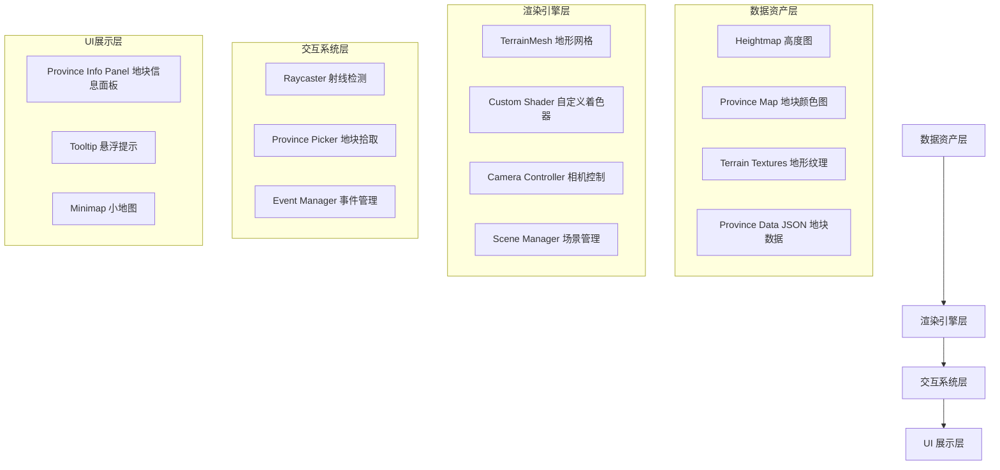
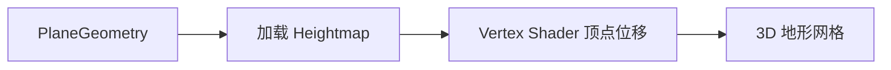
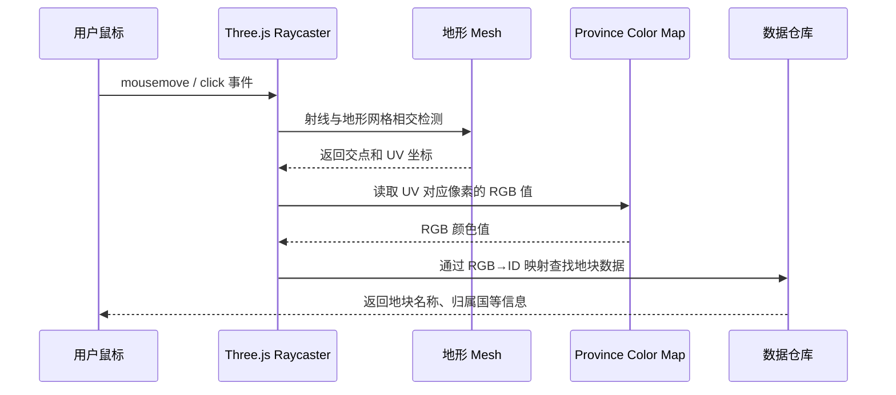
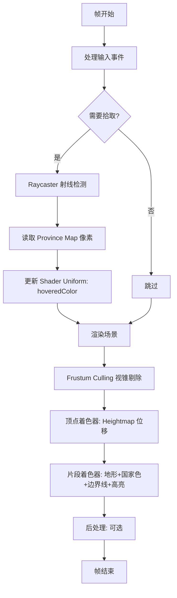

# HOI4 风格 3D 交互式世界地图 — 架构设计文档

## 1. 项目概述

使用 **Three.js (WebGL)** 在浏览器中实现一个类似《钢铁雄心4》的 3D 交互式世界地图。地图具有真实的高低地形起伏，数百个地块可以被鼠标点击/悬停交互，支持缩放和平移，并在性能上做到 60fps 流畅运行。

### 技术栈
| 类别 | 选型 |
|------|------|
| 构建工具 | Vite |
| 3D 引擎 | Three.js (WebGL2 Renderer) |
| 着色器 | 自定义 GLSL (Vertex + Fragment Shader) |
| UI 层 | HTML/CSS Overlay |
| 语言 | TypeScript |
| 包管理 | npm |

---

## 2. 系统架构总览



---

## 3. 核心模块详细设计

### 3.1 数据资产层

#### 3.1.1 高度图 (Heightmap)
- **格式**：PNG 灰度图，分辨率推荐 `4096x2048` 或 `8192x4096`
- **数据来源**：可使用 NASA SRTM 公开地形数据，或使用简化版世界高度图
- **用途**：在顶点着色器中对平面网格的 Y 坐标进行位移，形成 3D 地形

#### 3.1.2 地块颜色图 (Province Color Map)
- **格式**：PNG RGB 图，**必须使用 Nearest/Point 采样**（无抗锯齿、无插值）
- **分辨率**：与高度图相同 `4096x2048`
- **规则**：每个地块填充唯一的 RGB 颜色值，颜色之间不允许有渐变或混合
- **示例**：地块 #001 → `rgb(1, 0, 0)`，地块 #002 → `rgb(2, 0, 0)`，...

#### 3.1.3 地块数据 (Province Data)
```json
{
  "provinces": {
    "010000": {
      "name": "北京",
      "owner": "CHI",
      "type": "land",
      "terrain": "plains",
      "population": 21540000
    },
    "020000": {
      "name": "东京",
      "owner": "JAP",
      "type": "land",
      "terrain": "urban",
      "population": 13960000
    }
  },
  "countries": {
    "CHI": { "name": "中国", "color": [0.9, 0.2, 0.2] },
    "JAP": { "name": "日本", "color": [0.9, 0.9, 0.9] }
  }
}
```
- **颜色编码**：Province Color Map 中的 RGB 值直接作为 key 使用
- **RGB → ProvinceID 映射**：`R * 65536 + G * 256 + B` = ProvinceID

#### 3.1.4 地形纹理 (Terrain Textures)
- 草地、沙漠、雪地、山地、海洋等纹理，使用 tiling repeat
- 可选：Terrain Type Map（另一张图指定每个像素对应哪种地形纹理）

---

### 3.2 渲染引擎层

#### 3.2.1 地形网格生成



- 使用 `THREE.PlaneGeometry(width, height, segmentsW, segmentsH)` 创建高细分平面
- 将平面分为多个 **Chunk**（例如 8x4 = 32 个区块），每个区块独立为一个 Mesh
- 好处：利用 Three.js 内置的 **Frustum Culling** 自动剔除视野外的区块

**Chunk 划分策略**：
```
世界地图 (经度 -180 ~ 180, 纬度 -90 ~ 90)
├── Chunk [0,0]: -180~-135, 45~90
├── Chunk [1,0]: -135~-90, 45~90
├── ...
└── Chunk [7,3]: 135~180, -90~-45

每个 Chunk 细分度: 256x256 顶点（可调）
总顶点数: 32 chunks × 65536 vertices = ~2M 顶点
```

#### 3.2.2 自定义着色器 (Custom Shader)

**顶点着色器 (Vertex Shader)**：
```glsl
uniform sampler2D u_heightmap;
uniform float u_heightScale;
varying vec2 v_uv;
varying float v_height;

void main() {
    v_uv = uv;
    float height = texture2D(u_heightmap, uv).r;
    v_height = height;
    
    vec3 newPosition = position;
    newPosition.y += height * u_heightScale;
    
    gl_Position = projectionMatrix * modelViewMatrix * vec4(newPosition, 1.0);
}
```

**片段着色器 (Fragment Shader)**：
```glsl
uniform sampler2D u_provinceMap;      // 地块颜色图
uniform sampler2D u_terrainTexture;   // 地形纹理
uniform sampler2D u_countryLUT;       // 国家颜色查找表
uniform vec3 u_hoveredProvinceColor;  // 当前悬停的地块颜色
uniform vec3 u_selectedProvinceColor; // 当前选中的地块颜色
uniform vec2 u_mapSize;              // 地图纹理尺寸

varying vec2 v_uv;
varying float v_height;

// 边界线检测：采样周围像素，若颜色不同则为边界
float getBorder(vec2 uv) {
    vec2 texel = 1.0 / u_mapSize;
    vec3 center = texture2D(u_provinceMap, uv).rgb;
    vec3 right  = texture2D(u_provinceMap, uv + vec2(texel.x, 0.0)).rgb;
    vec3 up     = texture2D(u_provinceMap, uv + vec2(0.0, texel.y)).rgb;
    vec3 left   = texture2D(u_provinceMap, uv - vec2(texel.x, 0.0)).rgb;
    vec3 down   = texture2D(u_provinceMap, uv - vec2(0.0, texel.y)).rgb;
    
    float diff = 0.0;
    diff += length(center - right);
    diff += length(center - up);
    diff += length(center - left);
    diff += length(center - down);
    
    return step(0.01, diff);
}

void main() {
    // 1. 基础地形颜色
    vec3 terrainColor = texture2D(u_terrainTexture, v_uv * 20.0).rgb;
    
    // 2. 读取地块颜色
    vec3 provinceColor = texture2D(u_provinceMap, v_uv).rgb;
    
    // 3. 根据地块颜色查找国家颜色（通过 LUT 纹理）
    // ... 省略 LUT 查找逻辑 ...
    
    // 4. 混合地形和国家颜色
    vec3 finalColor = mix(terrainColor, countryColor, 0.4);
    
    // 5. 高亮悬停/选中地块
    if (distance(provinceColor, u_hoveredProvinceColor) < 0.01) {
        finalColor = mix(finalColor, vec3(1.0), 0.3);
    }
    if (distance(provinceColor, u_selectedProvinceColor) < 0.01) {
        finalColor = mix(finalColor, vec3(1.0, 0.8, 0.0), 0.4);
    }
    
    // 6. 叠加边界线
    float border = getBorder(v_uv);
    finalColor = mix(finalColor, vec3(0.0), border * 0.8);
    
    // 7. 简单光照（基于高度）
    float light = 0.6 + 0.4 * v_height;
    finalColor *= light;
    
    gl_FragColor = vec4(finalColor, 1.0);
}
```

#### 3.2.3 相机控制
- 基于 `OrbitControls` 改造，限制为 **策略地图相机**：
  - 鼠标右键拖拽平移
  - 滚轮缩放（限制最近/最远距离）
  - 缩放时相机俯仰角自动调整（远看俯视 → 近看倾斜）
  - 可选：键盘 WASD 平移

---

### 3.3 交互系统层

#### 3.3.1 地块拾取流程



**关键实现细节**：
1. `THREE.Raycaster` 对地形 Mesh 进行射线检测
2. 从交点获取 UV 坐标
3. 在 JS 端预加载 Province Map 到一个隐藏的 Canvas 中
4. 使用 `canvas.getContext('2d').getImageData()` 读取 UV 对应位置的像素
5. 将 RGB 转换为 Province ID：`id = R * 65536 + G * 256 + B`
6. 通过 ID 查找数据字典获取地块信息

**性能注意**：
- `mousemove` 事件需要节流（throttle），建议每 50ms 检测一次
- Raycaster 只对当前可见的 Chunk 进行检测

---

### 3.4 UI 展示层

- **HTML Overlay**：使用绝对定位的 HTML/CSS 元素覆盖在 Canvas 上方
- **地块信息面板**：点击地块后在右侧显示详细信息
- **Tooltip**：鼠标悬停时在鼠标旁显示地块名称
- **小地图（可选）**：左下角显示 2D 俯视图，标注当前视野范围

---

## 4. 项目文件结构

```
c:/map/
├── index.html
├── package.json
├── tsconfig.json
├── vite.config.ts
├── public/
│   └── assets/
│       ├── heightmap.png          # 世界高度图
│       ├── province-map.png       # 地块颜色图
│       ├── terrain-grass.jpg      # 地形纹理
│       ├── terrain-desert.jpg
│       ├── terrain-snow.jpg
│       └── terrain-water.jpg
├── src/
│   ├── main.ts                    # 入口文件
│   ├── scene/
│   │   ├── SceneManager.ts        # 场景管理器
│   │   ├── CameraController.ts    # 相机控制
│   │   └── LightManager.ts        # 光照管理
│   ├── terrain/
│   │   ├── TerrainManager.ts      # 地形管理器（Chunk 生成与管理）
│   │   ├── TerrainChunk.ts        # 单个地形区块
│   │   └── shaders/
│   │       ├── terrain.vert.glsl  # 顶点着色器
│   │       └── terrain.frag.glsl  # 片段着色器
│   ├── interaction/
│   │   ├── ProvincePicker.ts      # 地块拾取器
│   │   └── InputManager.ts        # 输入管理
│   ├── data/
│   │   ├── ProvinceStore.ts       # 地块数据仓库
│   │   └── provinces.json         # 地块定义数据
│   ├── ui/
│   │   ├── ProvincePanel.ts       # 地块信息面板
│   │   └── Tooltip.ts             # 悬浮提示
│   └── utils/
│       ├── TextureLoader.ts       # 纹理加载工具
│       └── ColorUtils.ts          # 颜色/ID 转换工具
├── plans/
│   └── architecture_design.md     # 本文档
└── README.md
```

---

## 5. 渲染管线流程



---

## 6. 性能优化策略

| 优化项 | 实现方式 | 预期效果 |
|--------|----------|----------|
| Chunk 分块 | 将世界分为 8×4=32 个区块 | 自动视锥剔除，减少 50-70% 绘制量 |
| LOD 多层细节 | 远处 Chunk 降低细分度 | 远处细分度降至 64×64，减少 75% 顶点 |
| 纹理压缩 | 使用 KTX2/Basis 压缩格式 | 显存占用减少 75% |
| 事件节流 | mousemove 每 50ms 触发一次拾取 | 减少 CPU 开销 |
| GPU 拾取（高级） | 使用离屏 RenderTarget 渲染 Province Map | 比 Canvas 读取更快 |
| 对象池 | 复用 Vector3/Raycaster 等临时对象 | 减少 GC 压力 |

---

## 7. 开发阶段规划

### Phase 1：基础框架 + 地形渲染
- 搭建 Vite + Three.js + TypeScript 项目
- 生成一个简单的高度图（可用程序生成噪声地形做原型）
- 实现 PlaneGeometry + Heightmap 顶点位移
- 基础相机控制

### Phase 2：地块系统 + 交互
- 创建 Province Color Map（先手动制作一个简单的测试图）
- 实现 Raycaster + UV 拾取 + Province ID 查找
- 实现 Shader 中的边界线绘制
- 实现悬停高亮和点击选中效果

### Phase 3：真实数据 + UI
- 接入真实世界高度图数据
- 制作完整的地块数据
- 实现 UI 面板（地块信息、tooltip）
- 国家颜色叠加

### Phase 4：性能优化 + 打磨
- Chunk 分块 + Frustum Culling
- LOD 系统
- 纹理压缩
- 小地图
- 视觉效果打磨（海洋着色、云层等）
