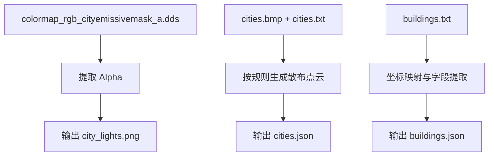
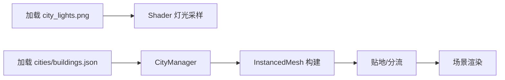

# 城市灯光与建筑实例化专题设计

## 0. 文档定位与交叉引用

### 0.1 文档定位
- **文档层级**：L2（专题）
- **作用**：定义城市夜景灯光、建筑实例化渲染、贴地与分流策略。
- **实现基线来源**：[`architecture_design.md`](./architecture_design.md)

### 0.2 关联文档
- 全局约束与术语：[`architecture_design.md`](./architecture_design.md)
- State / 海域专题：[`state_admin_divisions.md`](./state_admin_divisions.md)

---

## 1. 目标与范围

### 1.1 目标
1. 从 HOI4 资源中提取并使用城市灯光掩码（`city_lights.png`）。
2. 生成城市建筑与特殊建筑实例数据（`cities.json`、`buildings.json`）。
3. 在前端通过 `THREE.InstancedMesh` 高性能渲染大规模建筑。
4. 通过贴地与陡坡分流策略，避免建筑浮空/半埋并提升山区稳定性。

### 1.2 范围
- 数据转换：城市灯光、城市散布、特殊建筑解析与导出。
- Shader：夜景灯光叠加策略（受昼夜/光照约束）。
- 渲染：建筑实例化与材质策略。
- 算法：建筑贴地、重定位、隐藏分流、采样稳定化。

### 1.3 非目标
- 不直接加载 Paradox `.mesh` 作为最终建筑模型。
- 不在本专题引入新地图模式（保持全局 4 模式基线）。
- 不在本专题处理 State / Strategic Region 交互行为细节。

---

## 2. 术语与统一约定

### 2.1 术语口径
| 术语 | 说明 |
|---|---|
| City Emissive Mask | 城市自发光掩码，来自 `colormap_rgb_cityemissivemask_a.dds` Alpha 通道 |
| City Scatter | 根据 `cities.bmp` + `cities.txt` 生成的建筑点云散布 |
| Special Building | 来自 `buildings.txt` 的工厂、防空、港口等有明确坐标建筑 |
| Grounding | 建筑贴地计算流程 |
| Relocation | 陡坡/不可行点位重定位过程 |

### 2.2 全局规则继承
- 地图模式编号继承全局：0（政治）/1（地形）/2（高度）/3（行政区）。
- 城市灯光叠加不能破坏陆海作用域规则。
- 城市灯光与建筑表现服从性能优先原则（优先可用与稳定）。

### 2.3 命名规范
- 资源命名：`city_lights.png`、`cities.json`、`buildings.json`。
- 贴地配置分组：`BUILDING_GROUNDING_PROFILE`、`CITY_GROUNDING_PROFILE`。
- 运行时字段使用 `camelCase`（如 `heightSpread`、`relocationRings`）。

---

## 3. 数据输入输出与依赖

### 3.1 输入资源
- `colormap_rgb_cityemissivemask_a.dds`
- `cities.bmp`、`cities.txt`
- `buildings.txt`
- `heightmap.bmp` / `heightmap.png`

### 3.2 输出资源
1. `public/assets/city_lights.png`
2. `public/assets/cities.json`
3. `public/assets/buildings.json`

### 3.3 输出数据契约（建议）

#### 城市散布数据（`cities.json`）
```json
[
  {
    "x": 1234.5,
    "z": 678.9,
    "type": "westerngfx_house_1_1",
    "rotation": 1.57
  }
]
```

#### 特殊建筑数据（`buildings.json`）
```json
[
  {
    "x": 2345.6,
    "z": 789.1,
    "y": 0.0,
    "type": "arms_factory",
    "rotation": 3.14
  }
]
```

### 3.4 关键依赖文件
- 转换脚本：`scripts/convert-hoi4-data.mjs`
- 渲染管理：`src/terrain/TerrainManager.ts`
- Shader：`src/terrain/shaders/terrain.frag.glsl`
- 主流程接线：`src/main.ts`
- 建议新增：`src/city/CityManager.ts`

---

## 4. 架构与流程设计

### 4.1 离线转换流程


### 4.2 运行时渲染流程


### 4.3 Shader 灯光叠加核心逻辑
```glsl
uniform sampler2D u_cityLightsMap;

float lightMask = texture2D(u_cityLightsMap, getHoi4TerrainUv(v_uv)).r;
lightMask = smoothstep(0.1, 0.9, lightMask);
vec3 cityLightColor = vec3(1.0, 0.85, 0.5) * 1.5;
float darkness = 1.0 - smoothstep(0.0, 0.5, ndotl);
baseColor += cityLightColor * lightMask * darkness;
```

说明：
1. `lightMask` 做对比度压缩，减小灰雾感。
2. `darkness` 控制仅在背光区域增强夜景表现。
3. 海洋区域应避免不必要城市灯光污染。

---

## 5. 实施计划

### 5.1 数据转换改造
1. 取消对城市掩码 Alpha 的强制覆盖。
2. 提取 `city_lights.png`（建议单通道灰度）。
3. 解析 `buildings.txt` 输出 `buildings.json`。
4. 解析 `cities.bmp` + `cities.txt` 生成 `cities.json`。
5. 建筑量过大时可按 Chunk 拆分或输出二进制格式（后续优化项）。

### 5.2 前端渲染改造
1. TerrainManager 加载并传递 `u_cityLightsMap`。
2. `terrain.frag.glsl` 落地夜景灯光叠加。
3. 新建 `CityManager.ts`，加载 `cities.json` / `buildings.json`。
4. 使用 `THREE.InstancedMesh` 渲染占位建筑。
5. 在 `main.ts` 中接线 `CityManager` 生命周期。

### 5.3 建筑几何与材质策略
- **几何体**：先用 `BoxGeometry` / `CylinderGeometry` 占位。
- **材质**：`MeshStandardMaterial` 或 `MeshLambertMaterial`。
- **扩展**：后续可接入简化 glTF 模型替换占位体。

---

## 6. 验收与回归

### 6.1 城市灯光验收
1. 夜侧城市灯光可见，亮侧明显衰减。
2. 陆地与海域边界处无明显光斑泄漏。
3. 灯光强度在 4 模式下可接受，不干扰核心边界识别。

### 6.2 建筑实例验收
1. 城市与特殊建筑总体分布合理。
2. 大规模实例下帧率可接受（重点看 CPU 提交与 GPU 批次）。
3. 建筑类型差异可辨（尺寸/色调/形状）。

### 6.3 贴地验收
1. 无明显浮空。
2. 无明显半埋。
3. 陡坡区域优先重定位，失败则隐藏，不出现离谱姿态。
4. 地图边缘（X wrap）与南北边界（Y clamp）采样连续。

---

## 7. 风险与维护

| 风险 | 影响 | 缓解措施 |
|---|---|---|
| 城市掩码提取失真 | 夜景过亮或过暗 | 固定提取流程并做直方图抽样检查 |
| 建筑实例过多 | 前端性能下降 | InstancedMesh、分批加载、Chunk 化 |
| 贴地参数不稳 | 浮空/半埋/抖动 | 分离配置 + 采样平滑 + 分流策略 |
| 坐标映射误差 | 建筑错位 | 统一 HOI4→Three.js 坐标映射公式并文档化 |

---

## 附录 A：贴地与分流算法（2026-02）

### A.1 双边约束贴地
输入采样（中心 + 四向 + 四角 + 内环四点）得到：
- `hMin`：占地最低点
- `hMax`：占地最高点
- `hAvg`：占地平均高度
- `heightSpread = hMax - hMin`

约束区间：
- `lowerBound = hMax - maxEmbed`
- `upperBound = hMin + maxFloat`

目标高度：
- `targetY = hAvg + baseLift + slope * slopeLiftFactor`

最终高度：
- 可行区间：`finalY = clamp(targetY, lowerBound, upperBound)`
- 不可行区间（`lowerBound > upperBound`）：转入分流

### A.2 陡坡分流
触发条件（任一满足）：
1. `lowerBound > upperBound`
2. `heightSpread > steepSpreadThreshold`

流程：
1. 以原点做环形候选搜索（`ring + angle`）。
2. 评分综合距离、spread、center 偏差、slope。
3. 选最优可行点；全部失败则隐藏实例。

> 特殊建筑重定位需叠加省份占地校验，避免跨行政边界错位。

### A.3 采样稳定性修正
- 法线采样：中心 + 四邻域加权。
- 高度采样：LOD 三角插值后做小半径平滑。
- 坐标边界：X 方向 wrap，Y 方向 clamp。

## 附录 B：参数分组（可调）

### `BUILDING_GROUNDING_PROFILE`
- `maxEmbed=0.0014`
- `maxFloat=0.0018`
- `baseLift=0.0009`
- `slopeLiftFactor=0.0008`
- `steepSpreadThreshold=0.0048`
- `relocationRings=4`
- `relocationStepPx=1.25`
- `relocationAngles=12`

### `CITY_GROUNDING_PROFILE`
- `maxEmbed=0.0018`
- `maxFloat=0.0024`
- `baseLift=0.0010`
- `slopeLiftFactor=0.0009`
- `steepSpreadThreshold=0.0056`
- `relocationRings=3`
- `relocationStepPx=1.1`
- `relocationAngles=10`

## 附录 C：手动回归建议
按场景（山区/丘陵/海岸/平原）逐项检查：
1. 浮空/半埋
2. 姿态稳定性
3. 边界连续性
4. 指标稳定性（`hMin/hMax/heightSpread/finalY`）
