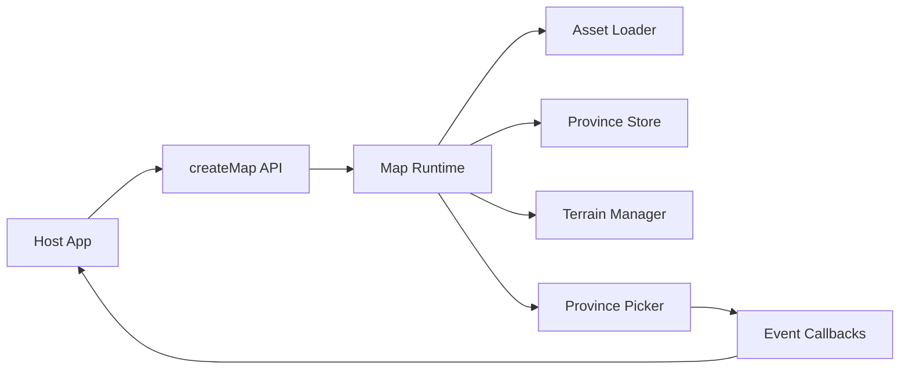
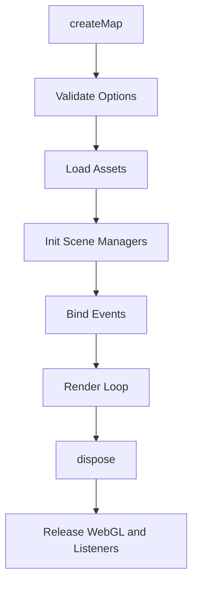

# 地图 npm 包化实施计划

## 1. 目标与边界

- 目标：将现有地图能力改造为可发布的 npm 包，供其他项目 `import` 使用。
- 首版 API：`createMap`、`setMapMode`、`dispose`。
- 资源策略：npm 包不内置大体积资源，全部通过外部 URL 或 CDN 提供。
- UI 策略：首版不内置面板和按钮，只暴露方法与事件，由宿主项目自行实现 UI。

## 2. 现状耦合诊断

当前核心逻辑高度集中在 `src/main.ts`，包含：

1. 资源加载与路径拼接
2. Three.js 场景初始化
3. 动画循环与输入事件
4. 城市与建筑实例化
5. 拾取、UI、图层开关

同时存在以下耦合点：

- DOM 固定节点耦合：`UIManager` 直接依赖页面中的固定 id 节点。
- 视口耦合：拾取器依赖 `window.innerWidth`、`window.innerHeight`。
- 资源路径耦合：`assetUrl` 依赖当前应用部署路径。
- 入口耦合：`main()` 直接启动，不可被外部生命周期控制。

## 3. 首版对外 API 设计

```ts
export type MapMode = 'political' | 'state' | 'terrain' | 'heightmap';

export interface MapAssets {
  heightmap: string;
  provinces: string;
  rivers: string;
  terrainColormap: string;
  waterColormap: string;
  cityLights: string;
  provincesJson: string;
  statesJson: string;
  citiesJson: string;
  buildingsJson: string;
  cityObj: string;
  cityDiffuse?: string;
  cityNormal?: string;
}

export interface CreateMapOptions {
  container: HTMLElement;
  assets: MapAssets;
  initialMapMode?: MapMode;
  onHover?: (payload: MapHoverPayload | null) => void;
  onSelect?: (payload: MapSelectPayload | null) => void;
  onError?: (error: unknown) => void;
}

export interface MapInstance {
  setMapMode: (mode: MapMode) => void;
  dispose: () => void;
}

export declare function createMap(options: CreateMapOptions): Promise<MapInstance>;
```

设计原则：

- 对外只给稳定语义，不暴露内部 manager 实例。
- `MapMode` 对外用字符串，内部再映射为 shader 所需数字。
- 事件回调只返回序列化友好数据，避免把 Three.js 对象泄漏给宿主。

## 4. 目录与模块拆分方案

建议新增结构：

```text
src/
  lib/
    index.ts
    createMap.ts
    types.ts
  runtime/
    MapRuntime.ts
    lifecycle.ts
    input.ts
    assets/
      AssetLoader.ts
      manifest.ts
    adapters/
      HoverSelectAdapter.ts
```

复用现有模块：

- `terrain/TerrainManager.ts`
- `interaction/ProvincePicker.ts`
- `data/ProvinceStore.ts`

处理策略：

- `UIManager.ts` 从核心路径移除，作为 demo 或宿主参考实现。
- `main.ts` 改为 demo 启动文件，内部调用 `createMap`。

## 5. 生命周期重构

### 初始化流程

1. 校验 `CreateMapOptions`
2. 加载 JSON 与纹理资源
3. 初始化 scene camera renderer controls
4. 初始化 TerrainManager ProvinceStore ProvincePicker
5. 绑定输入事件与动画循环
6. 返回 `MapInstance`

### 销毁流程

`dispose` 需要保证：

1. 停止动画循环
2. 解绑所有事件监听
3. 从容器移除 canvas
4. 释放 geometry material texture
5. 调用 `renderer.dispose`
6. 清理内部引用，避免闭包持有大对象

## 6. 资源协议设计

首版采用显式资源清单，不做隐式猜测：

- `assets` 必须传完整 URL。
- 允许宿主自行拼接 CDN 版本路径。
- 对每个资源加载错误输出明确上下文，包含资源键名与 URL。

推荐后续可选增强：

- 支持 `assetBaseUrl + manifest` 模式。
- 支持 `version` 字段与缓存策略。

## 7. 构建与发布方案

- 将构建分为两类：
  - library 构建：输出 ESM 与类型声明
  - demo 构建：用于本地联调和截图验证
- `package.json` 增加：
  - `name`
  - `exports`
  - `types`
  - `files`
  - `peerDependencies` 三方库边界
- 保持 `three` 在 peerDependencies，避免宿主重复打包多个 Three 实例。

## 8. 最小消费示例

宿主项目中：

1. 准备容器元素
2. 调用 `createMap`
3. 通过实例调用 `setMapMode`
4. 页面卸载时调用 `dispose`

## 9. 验证与回归清单

功能维度：

- 地图成功渲染
- `setMapMode` 切换四种模式正确
- hover 与 select 事件可回调
- 城市 建筑 灯光按既有逻辑表现

稳定性维度：

- 多次创建 销毁后无重复事件绑定
- 销毁后显存与内存增长可控
- 资源 404 或 CORS 错误可被明确上报

兼容维度：

- 不同容器尺寸下拾取仍准确
- 外部项目路由切换后可重复挂载

## 10. 实施顺序

1. 抽离 `types` 与对外 API 壳
2. 抽离 `MapRuntime` 并迁移 `main` 初始化逻辑
3. 接入回调事件并移除内置 UI 依赖
4. 补 `dispose` 完整回收链路
5. 切换到 library 构建与包导出
6. 用 demo 验证与回归

## 11. 架构流程图





## 12. 交付定义

进入代码实现阶段后，首个可交付版本以以下标准验收：

- 外部项目可通过 npm 依赖并成功 `import`。
- 至少可调用 `createMap`、`setMapMode`、`dispose`。
- 不要求内置 UI，但 hover 与 select 事件可供宿主 UI 使用。
- 资源完全来自外部 URL 或 CDN。