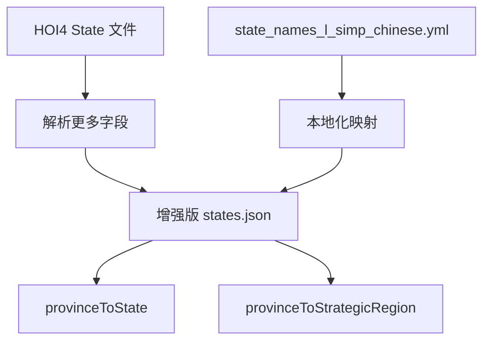
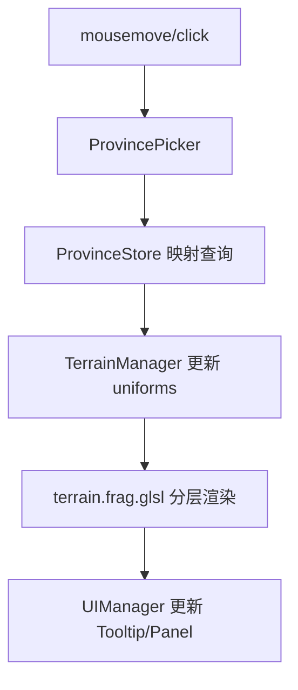

# HOI4 一级行政区（State）与海域（Strategic Region）专题设计

## 0. 文档定位与交叉引用

### 0.1 文档定位
- **文档层级**：L2（专题）
- **作用**：定义 State / Strategic Region 相关的数据、渲染、交互、UI 联动方案。
- **实现基线来源**：[`architecture_design.md`](./architecture_design.md)

### 0.2 关联文档
- 全局约束与术语：[`architecture_design.md`](./architecture_design.md)
- 城市灯光与建筑专题：[`city_and_lights_architecture.md`](./city_and_lights_architecture.md)

---

## 1. 目标与范围

### 1.1 目标
1. 补齐 State 级别边界、悬停、选中、信息展示。
2. 在不增加新地图模式的前提下，完善海域（Strategic Region）交互与边界显示。
3. 保证陆海作用域分离：陆地突出 State，海域突出 Strategic Region。
4. 与全局渲染优先级保持一致：`Province > State > Strategic Region`。

### 1.2 范围
- 离线数据转换：增强 `states.json` 字段及映射。
- 运行时数据层：ProvinceStore 提供 State / Strategic Region 查询能力。
- 渲染层：Shader 增加 State / Strategic Region 边界与高亮链路。
- 交互层：ProvincePicker 限制海域触发作用域。
- UI 层：面板与 Tooltip 字段联动与回退。

### 1.3 非目标
- 不新增独立“海域模式”按钮，保持 4 模式（0/1/2/3）。
- 不在本专题引入新的地形或建筑渲染机制（由城市专题负责）。

---

## 2. 术语与统一约定

### 2.1 术语口径
| 术语 | 说明 |
|---|---|
| Province | 最小可交互地块 |
| State | 一级行政区，包含多个 Province |
| Strategic Region | 战略区域，海域交互重点层 |
| State LUT | 供 Shader 做 State 边界/高亮比较的纹理 |
| Strategic Region LUT | 供 Shader 做海域边界/高亮比较的纹理 |

### 2.2 地图模式编号（沿用全局）
| 编号 | 模式 |
|---|---|
| 0 | 政治 |
| 1 | 地形 |
| 2 | 高度 |
| 3 | 行政区 |

### 2.3 统一渲染规则
1. 高亮优先级：`Province > State > Strategic Region`。
2. 陆地边界：`国家 > State > Province`。
3. 海域边界：`Strategic Region 主线 + 必要 Province 细线`。
4. 作用域约束：
   - 海域不显示 State 线与 State 高亮。
   - 陆地不显示 Strategic Region 主线与海域高亮。

---

## 3. 数据输入输出与依赖

### 3.1 输入数据
- `public/assets/provinces.json`
- `public/assets/states.json`
- `public/assets/provinces.png`
- HOI4 原始 State 定义文件
- `state_names_l_simp_chinese.yml`（中文本地化）

### 3.2 目标数据结构（`states.json`）
```json
{
  "states": {
    "1": {
      "id": 1,
      "name": "STATE_1",
      "localName": "科西嘉",
      "owner": "FRA",
      "provinces": [3838, 9851, 11804],
      "manpower": 322900,
      "category": "town",
      "victoryPoints": { "3838": 1 },
      "cores": ["COR", "FRA"]
    }
  },
  "provinceToOwner": { "3838": "FRA" },
  "provinceToState": { "3838": 1, "9851": 1, "11804": 1 },
  "provinceToStrategicRegion": { "10001": 16 },
  "countries": {
    "FRA": { "code": "FRA", "name": "FRA", "color": [0.2, 0.3, 0.8] }
  }
}
```

### 3.3 运行时派生资产
1. `State LUT`：与 `provinces.png` 同尺寸，像素颜色映射到所属 State。
2. `Strategic Region LUT`：与 `provinces.png` 同尺寸，像素颜色映射到所属 Strategic Region。

### 3.4 关键依赖
- 转换脚本：`scripts/convert-hoi4-data.mjs`
- 数据层：`src/data/ProvinceStore.ts`
- 渲染层：`src/terrain/TerrainManager.ts`、`src/terrain/shaders/terrain.frag.glsl`
- 交互层：`src/interaction/ProvincePicker.ts`
- UI 层：`src/ui/UIManager.ts`、`index.html`、`src/main.ts`

---

## 4. 架构与流程设计

### 4.1 离线转换流程


### 4.2 运行时交互与渲染流程


### 4.3 Shader 关键接口
```glsl
uniform sampler2D u_stateLUT;
uniform sampler2D u_strategicRegionLUT;
uniform vec3 u_hoveredStateColor;
uniform vec3 u_hoveredStrategicRegionColor;
```

State 边界检测示例：
```glsl
float getStateBorder(vec2 uv) {
    vec2 texel = 1.0 / u_mapSize;
    vec3 center = texture2D(u_stateLUT, uv).rgb;
    float diff = 0.0;
    for (int dy = -1; dy <= 1; dy++) {
        for (int dx = -1; dx <= 1; dx++) {
            if (dx == 0 && dy == 0) continue;
            vec3 n = texture2D(u_stateLUT, uv + vec2(float(dx), float(dy)) * texel).rgb;
            diff += step(0.003, length(center - n));
        }
    }
    return clamp(diff / 4.0, 0.0, 1.0);
}
```

---

## 5. 实施计划

### 5.1 文件改动清单
| 文件 | 修改类型 | 说明 |
|---|---|---|
| `scripts/convert-hoi4-data.mjs` | 修改 | 解析 State 扩展字段 + 中文本地化 + 关系映射 |
| `public/assets/states.json` | 重新生成 | 输出增强字段与映射 |
| `src/data/ProvinceStore.ts` | 修改 | State / Strategic Region 查询接口与 LUT 生成 |
| `src/terrain/TerrainManager.ts` | 修改 | 传递 LUT 与高亮 uniforms |
| `src/terrain/shaders/terrain.frag.glsl` | 修改 | State / Strategic Region 边界与高亮分层 |
| `src/interaction/ProvincePicker.ts` | 修改 | 限制 Strategic Region 仅海洋/湖泊触发 |
| `src/ui/UIManager.ts` | 修改 | State / Region 信息联动与字段回退 |
| `index.html` | 修改 | 行政区信息区块与模式按钮布局 |
| `src/main.ts` | 修改 | Picker ↔ UI ↔ TerrainManager 接线 |

### 5.2 执行顺序（基线）
1. 增强转换脚本并重新生成 `states.json`。
2. 在 ProvinceStore 增加 State / Strategic Region 数据查询与 LUT 生成。
3. TerrainManager 接入 `u_stateLUT` 与 `u_strategicRegionLUT`。
4. Shader 补齐 State / Strategic Region 边界检测与高亮叠加顺序。
5. ProvincePicker 收敛拾取作用域（海域限定）。
6. UIManager 统一面板字段优先级与 `--` 回退。
7. 仅保留 4 模式按钮并完成模式行为校验。

---

## 6. 验收与回归

### 6.1 数据一致性验收
- `provinceToState` 对陆地 Province 覆盖率应接近或达到 100%。
- `provinceToStrategicRegion` 对海洋/湖泊 Province 覆盖率应接近或达到 100%。
- LUT 未映射像素比例可解释（边界像素、无效像素）。

### 6.2 行为回归场景
1. 海峡：海域边界连续，无明显断裂。
2. 海岸线：陆地 State 线与海域 Region 线不互相污染。
3. 小岛：拾取稳定，不误吸附邻海。
4. 多国接壤：国家/State/Province 层级稳定。
5. State 交界：行政区模式中层边界连续。
6. 海域交界：4 模式下均可见且强度符合预期。

### 6.3 本轮记录（2026-02-28）
- TypeScript 检查：`npx tsc --noEmit` 通过。
- 构建问题：`npm run build` 失败于 `index.html?html-proxy&inline-css`（与本专题业务逻辑无直接关联，需单独排查构建链路）。
- 覆盖抽样：
  - 陆地 Province：`10122`，`provinceToState` 覆盖 `10122`（`100.00%`）。
  - 海洋/湖泊 Province：`3259`，`provinceToStrategicRegion` 覆盖 `3259`（`100.00%`）。

---

## 7. 风险与维护

| 风险 | 影响 | 缓解措施 |
|---|---|---|
| 海面片元提前 `return` | 海域高亮与边界失效 | 海面渲染参与统一高亮/边界管线后再输出颜色 |
| 陆海作用域未隔离 | 视觉污染、误高亮 | Picker + Shader 双重作用域约束 |
| 高亮叠加顺序漂移 | 用户感知不一致 | 固定执行顺序并纳入回归清单 |
| 字段回退不一致 | UI 出现脏值 | 不适用字段统一显示 `--` |

---

## 附录 A：模式行为矩阵（不新增海域模式）

| 地图模式 | 陆地底色 | 海域底色 | 高亮优先级 | 边界线策略 | Tooltip/面板规则 |
|---|---|---|---|---|---|
| 政治（0） | 国家色 × 地形混合 | HOI4 水体色 | Province > State > Strategic Region | 陆地：国家 > State > 省份；海域：Strategic Region 主线 + 必要省份细线 | 陆地显示 State+国家；海域显示海域名+国家（SEA/LAKE） |
| 地形（1） | HOI4 地形色 | HOI4 水体色 | Province > State > Strategic Region（State 仅陆地有效） | 陆地省份细线；海域保留 Strategic Region 线（弱化）+ 省份细线 | 同上 |
| 高度（2） | 高度伪彩 | 高度伪彩海色段 | Province > State > Strategic Region（State 仅陆地有效） | 陆地省份细线；海域保留 Strategic Region 线（弱化）+ 省份细线 | 同上 |
| 行政区（3） | State 色 × 地形混合 | HOI4 水体色 | Province > State > Strategic Region | 陆地：国家 > State；海域：Strategic Region 主线 + 必要省份细线 | 陆地标题优先 State；海域标题优先海域名 |

## 附录 B：硬规则清单
1. 不新增海域模式，保持 4 模式按钮。
2. 海域可见性修复后，禁止海面在片元阶段过早终止导致边界丢失。
3. 高亮按 `Strategic Region → State → Province` 叠加，最终视觉优先级为 `Province > State > Strategic Region`。
4. Strategic Region 悬停/选中仅在海洋/湖泊 Province 触发。
5. 海域不绘制 State 线；陆地不绘制 Strategic Region 主线。
