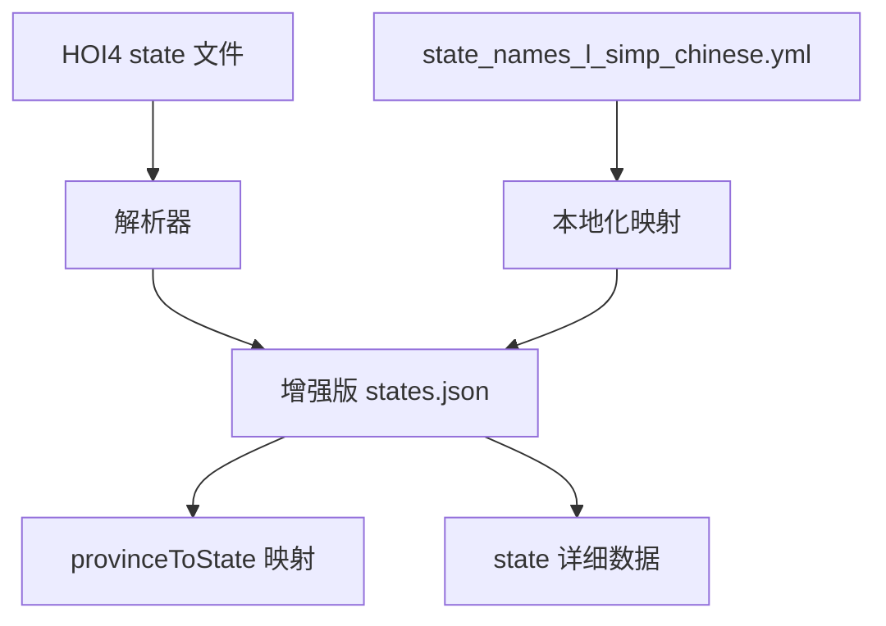
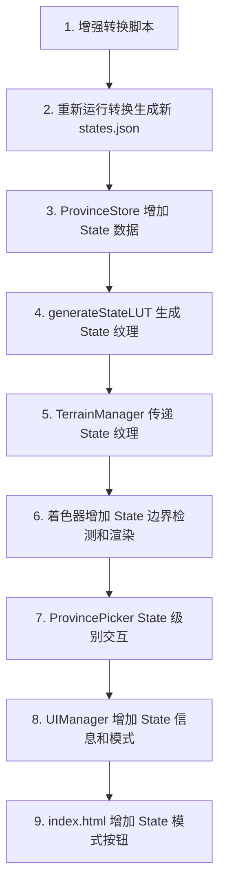

# HOI4 一级行政区（State）实现方案

## 一、现状分析

### 当前项目架构
```
数据流: HOI4 原始数据 → convert-hoi4-data.mjs → JSON/PNG → 浏览器端加载 → 3D 渲染
```

### 已有功能
- ✅ 省份（Province）级别的颜色映射和交互
- ✅ 国家级别边界线渲染（着色器 8 邻域检测）
- ✅ 省份级别边界线渲染（着色器 4 邻域虚线）
- ✅ State 数据已部分提取（id, name, owner, provinces）
- ✅ 中文 State 名称本地化文件存在（`state_names_l_simp_chinese.yml`）

### 缺失功能
- ❌ State 级别的边界线渲染（介于国家和省份之间的中间层级）
- ❌ State 级别的悬停/选中交互（当前只能选中单个省份）
- ❌ State 详细信息（人口、类别、核心领土、胜利点等）
- ❌ State 中文名称（当前使用原始 `STATE_xxx` 键名）
- ❌ State 地图模式（按行政区上色）

## 二、数据架构

### 2.1 增强 States 数据结构

当前 `states.json` 结构：
```json
{
  "states": {
    "1": { "id": 1, "name": "STATE_1", "owner": "FRA", "provinces": [3838, 9851, 11804] }
  },
  "provinceToOwner": { "3838": "FRA" },
  "countries": { "FRA": { "code": "FRA", "name": "FRA", "color": [0.2, 0.3, 0.8] } }
}
```

**目标结构**：
```json
{
  "states": {
    "1": {
      "id": 1,
      "name": "STATE_1",
      "localName": "科西嘉",
      "owner": "FRA",
      "provinces": [3838, 9851, 11804],
      "manpower": 322900,
      "category": "town",
      "victoryPoints": { "3838": 1 },
      "cores": ["COR", "FRA"]
    }
  },
  "provinceToOwner": { ... },
  "provinceToState": { "3838": 1, "9851": 1, "11804": 1 },
  "countries": { ... }
}
```

### 2.2 State LUT 纹理

类似现有的 `countryLUT`（国家颜色纹理），需要一个 **State LUT 纹理**：
- 与 `provinces.png` 同尺寸
- 每个像素颜色代表该省份所属 State 的唯一颜色
- 用于着色器中检测 State 边界

**State 颜色分配策略**：为每个 State ID 生成一个确定性的唯一 RGB 颜色：
```typescript
function stateIdToColor(stateId: number): [number, number, number] {
  // 使用 state ID 的位分布生成均匀分布的颜色
  const r = ((stateId * 137 + 43) % 256);
  const g = ((stateId * 89 + 157) % 256);
  const b = ((stateId * 53 + 211) % 256);
  return [r, g, b];
}
```

## 三、修改方案

### 3.1 数据转换脚本修改（`scripts/convert-hoi4-data.mjs`）

**修改内容**：
1. 解析更多 State 字段：`manpower`, `state_category`, `victory_points`, `add_core_of`
2. 读取中文本地化文件 `state_names_l_simp_chinese.yml`，映射 `STATE_xxx` → 中文名
3. 生成 `provinceToState` 映射
4. 输出增强版 `states.json`



### 3.2 ProvinceStore 增强（`src/data/ProvinceStore.ts`）

**新增接口**：
```typescript
interface StateData {
  id: number;
  name: string;         // 原始名
  localName: string;    // 中文名
  owner: string;        // 所属国家
  provinces: number[];  // 包含的省份 ID
  manpower: number;     // 人口
  category: string;     // 类别: town/city/metropolis 等
  victoryPoints: Record<number, number>; // 胜利点
  cores: string[];      // 核心领土国家
}
```

**新增方法**：
- `getStateByProvinceId(provId: number): StateData | undefined`
- `getStateById(stateId: number): StateData | undefined`
- `getAllStates(): StateData[]`
- `getStatesByCountry(countryCode: string): StateData[]`
- `generateStateLUT(provinceMapCanvas): HTMLCanvasElement` — 生成 State 颜色 LUT 纹理

### 3.3 着色器修改（`terrain.frag.glsl`）

**新增 Uniform**：
```glsl
uniform sampler2D u_stateLUT;  // State 颜色 LUT 纹理
```

**新增 State 边界检测函数**：
```glsl
float getStateBorder(vec2 uv) {
    vec2 texel = 1.0 / u_mapSize;
    vec3 center = texture2D(u_stateLUT, uv).rgb;
    float diff = 0.0;
    // 8 邻域采样，检测相邻像素是否属于不同 State
    for (int dy = -1; dy <= 1; dy++) {
        for (int dx = -1; dx <= 1; dx++) {
            if (dx == 0 && dy == 0) continue;
            vec3 neighbor = texture2D(u_stateLUT, uv + vec2(float(dx), float(dy)) * texel).rgb;
            diff += step(0.003, length(center - neighbor));
        }
    }
    return clamp(diff / 4.0, 0.0, 1.0);
}
```

**State 边界渲染层级**：
```
国家边界 > State 边界 > 省份边界
粗实线      中等虚线    细虚线
```

在政治模式和新增的 State 模式下渲染 State 边界，使用比国家边界细但比省份边界粗的线条。

### 3.4 TerrainManager 修改

**新增**：
- 接受并传递 `u_stateLUT` 纹理到着色器
- 添加 State 级别悬停/选中的 uniform 控制
- 新增地图模式：`3 = State 模式`

### 3.5 ProvincePicker 交互增强

**State 级别交互**：
- 悬停时高亮整个 State（所有属于该 State 的省份）
- 通过 `provinceToState` 映射查找同 State 的所有省份
- 着色器方案：传入当前悬停的 State LUT 颜色，与 `u_stateLUT` 对比实现整个 State 高亮

### 3.6 UI 修改

**信息面板增强**：
```html
<div class="info-row">
  <span class="info-label">行政区</span>
  <span class="info-value" id="panel-state-name">--</span>
</div>
<div class="info-row">
  <span class="info-label">行政区类别</span>
  <span class="info-value" id="panel-state-category">--</span>
</div>
<div class="info-row">
  <span class="info-label">行政区人口</span>
  <span class="info-value" id="panel-state-manpower">--</span>
</div>
```

**地图模式按钮增加**：
```html
<button class="map-mode-btn" data-mode="state">行政区</button>
```

### 3.7 State 地图模式

在 State 模式下：
- 每个 State 使用不同颜色着色（类似政治模式但按 State 而非国家）
- State 边界线为中等粗度实线
- 省份边界线不显示
- 国家边界线仍然显示（更粗）

## 四、实现流程



## 五、文件修改清单

| 文件 | 修改类型 | 说明 |
|------|----------|------|
| `scripts/convert-hoi4-data.mjs` | 修改 | 增强 state 解析 + 中文本地化 |
| `public/assets/states.json` | 重新生成 | 更丰富的 state 数据 |
| `src/data/ProvinceStore.ts` | 修改 | State 数据接口 + LUT 生成 |
| `src/terrain/TerrainManager.ts` | 修改 | 传递 State LUT 纹理 + 新地图模式 |
| `src/terrain/shaders/terrain.frag.glsl` | 修改 | State 边界检测 + 渲染 |
| `src/interaction/ProvincePicker.ts` | 修改 | State 级别交互 |
| `src/ui/UIManager.ts` | 修改 | State 信息面板 + 模式切换 |
| `index.html` | 修改 | State 面板 HTML + 模式按钮 |
| `src/main.ts` | 修改 | State LUT 纹理传递 |

## 六、关键技术点

### State 边界 vs 国家边界 vs 省份边界
- **着色器中三层边界共存**：通过三个不同的 LUT 纹理（province map、state LUT、country LUT）各自检测边界
- **渲染优先级**：国家边界最粗最暗 → State 边界中等 → 省份边界最细最淡
- **性能考虑**：State LUT 纹理与 province map 同尺寸，每帧多一次纹理采样，但 GPU 开销可控

### State 级别悬停高亮
- **方案**：着色器中新增 `u_hoveredStateColor` uniform，对比 `u_stateLUT` 采样值
- 当该 State 的所有像素颜色匹配 `u_hoveredStateColor` 时，应用高亮效果
- 这样可以一次性高亮整个 State 区域，无需逐省份处理
